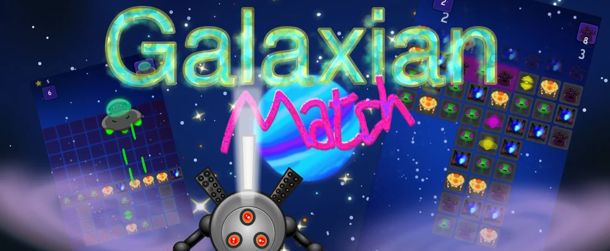

# Galaxian Match

A simple space-themed match-3 game and my first published game. 

## Build Prerequisites

- **CMake** installed.
- Install the dependencies for **Urho3D**. You can refer to the official documentation here: [Urho3D Build Instructions](https://u3d.io/docs/_building.html).

## Build Instructions

### Use CMake to generate the build files.

    cmake -S . -B build
    cd build
    make -j $(nproc)

Default build type: Release

## Installation

Once the build is complete, you can install the project using the appropriate installation command.

    make install

Default installation path: ./exe/bin

## To Do

Complete the implementation of networked gameplay using WebSocket.

## Third-Party

This project relies on the following third-party libraries:

- Urho3D engine
    - includes SDL, Box2D, ETCPACK, FreeType, GLEW, LZ4, LibCpuId, Mustache, PugiXml, SQLite, STB, StanHull, WebP, nanodbc, rapidjson
- libdatachannel
    - requires openssl

## Platforms

**Tested:** Windows, Linux, Android

## License

This project is licensed under the MIT License. For more details, see the LICENSE file.
