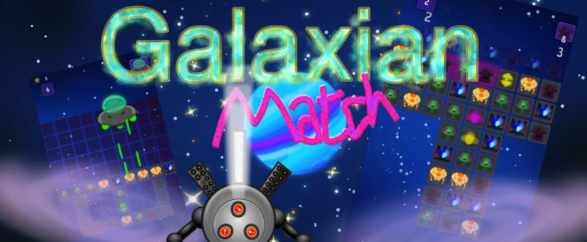

# Galaxian Match

A simple space-themed match-3 game and my first published game. 

## Build Prerequisites

- **CMake** installed.
- Install the dependencies for **U3D**. Official documentation here: [Urho3D Build Instructions](https://u3d.io/docs/_building.html).
- For web build, Emscripten installed. Official documentation here: [Emscripten Instructions](https://emscripten.org/docs/getting_started/index.html).

## Native Build Instructions

 Use CMake to generate the build files.

    cmake -S . -B build
    cmake --build build --config Release

- Game Build Options:
  
  - SPACEMATCH_WITH_DEMOMODE Enable Demo Mode - 3 first constellations only.
  - SPACEMATCH_WITH_TIPS Enable Keyboard Tips - key C adds a coin, key S adds a star.
  - SPACEMATCH_WITH_ADS Enable Ads on mobile.
  - SPACEMATCH_WITH_3D Enable some 3D features - currently 3D title in the mainmenu.
  - SPACEMATCH_WITH_CINEMATICS Enable story cinematics.

- WIP Options:
  
  - SPACEMATCH_WITH_NETWORK Enable networked mode.
  - SPACEMATCH_WITH_TEST Enable tests.
  
  
## Web Build Instructions

 Use the U3D script in the project root folder to generate build files:
 
    ./script/cmake_emscripten.sh build-web
    cmake --build build-web --config Release
 
 
## Installation

Once the build is complete, you can install the project using the appropriate installation command.

    cmake --install build

Default installation path: ./exe/bin

## To Do

Complete the implementation of networked gameplay using WebSocket.

## Third-Party

This project relies on the following third-party libraries:

- U3D engine
  - includes SDL, Box2D, ETCPACK, FreeType, GLEW, LZ4, LibCpuId, Mustache, PugiXml, SQLite, STB, StanHull, WebP, nanodbc, rapidjson
- libdatachannel
  - requires openssl

## Platforms

**Tested:** Windows, Linux, Android, Web

## License

This project is licensed under the MIT License. For more details, see the LICENSE file.
